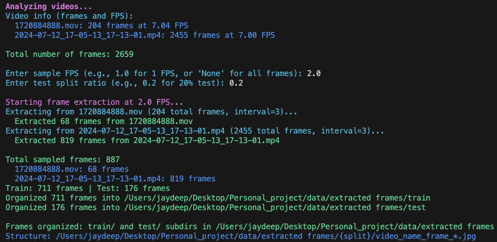
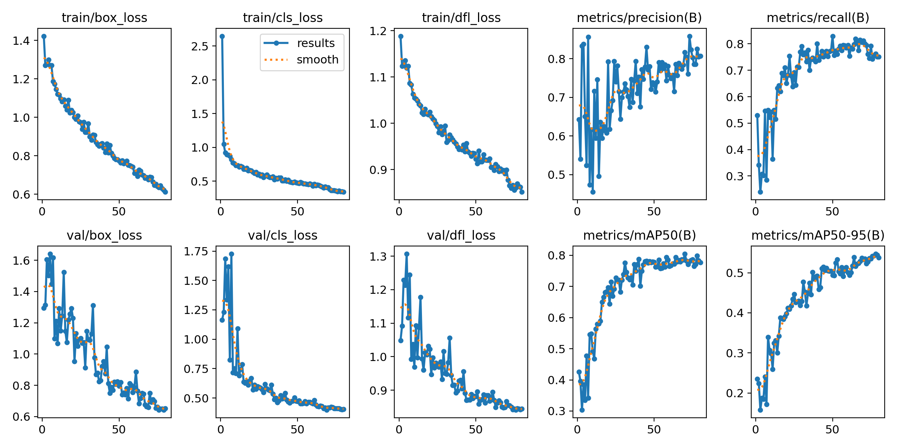

# Junior AI Engineer Assignment

## Overview

This repository contains code and utilities for building, training, and running a YOLOV11-S model to detect suspicious activity (Potential Shoplifting) in video.

Class Dictionary
```python
CLASS_NAMES = {
    0: "Person",
    1: "Normal wrist",
    2: "Wrist with product",
    3: "Suspicious"
}
```
Description

| Class ID | Label                  | Description                                                                                            |
| -------- | ---------------------- | -------------------------------------------------------------------------------------------------------|
| **0**    | **Person**             | Detects a person in the frame.                                                                         |
| **1**    | **Normal wrist**       | Identifies a wrist without any item or product in hand.                                                |
| **2**    | **Wrist with product** | Detects a wrist holding or interacting with a product.                                                 |
| **3**    | **Suspicious**         | Flags potentially suspicious activity.(potential shoplifiting activity like putting product in pocket) |

Main goals:
* prepare video data (extract frames and create train/test splits),
* train a YOLO model on the prepared dataset,
* run inference on videos,
* automatically detect and save short clips containing suspicious events.

Key scripts:

* `prepare_data.py` — frame extraction and dataset creation
* `train.py` — YOLO training script
* `inference.py` — run detections on video
* `find_suspicious_events.py` — detect and save suspicious event clips

---

## Setup Instructions

Follow these steps to set up the project locally on your machine.

### 1. Clone the Repository

Open your terminal and run:

```bash
git clone https://github.com/JayDeep1710/Assignment.git
```

---

### 2. Create a Virtual Environment

It’s recommended to create a virtual environment to manage dependencies cleanly.

#### For macOS/Linux:

```bash
python3 -m venv myenv
source myenv/bin/activate
```

#### For Windows:

```bash
python -m venv myenv
myenv\Scripts\activate
```

---

### 3. Install Dependencies

Once the environment is activated, install all required Python packages:

```bash
pip install -r requirements.txt
```

---

### 4. Download data

The data is stored in Google Drive and can be accessed using the following link:

```bash
https://drive.google.com/drive/folders/1o_Gp-goYRbYKZpYHVQ2ERUnoXIz-ZL1o?usp=sharing
```
### 5. Inference

```bash
python inference.py --video data/videos/2024-07-12_17-05-13_17-13-01.mp4 --classes 1,2,3
```
> Note: you can change the classes you need to show but for better visibility we are skipping class 0 (person)
---

## 🧾 Project Structure

A sample layout of this repository:

```
Project/
│
├── data/                               # Dataset folder
│   ├── train/                          # Training images and labels
│   ├── test/                           # Testing images and labels
│
├── suspicious_events/                  # Saved evidence of suspicious activities
│   ├── suspicious_001/                 
│   │   ├── annotated.mp4               # Model output with annotations
│   │   └── raw.mp4                     # Original unprocessed video
│   ├── suspicious_002/
│   │   ├── annotated.mp4
│   │   └── raw.mp4
│   └── ...
│
├── training_logs/                      # YOLO training artifacts
│   ├── weights/
│   │   ├── best.pt                     # Best model checkpoint
│   │   └── last.pt                     # Latest model checkpoint
│   ├── other training logs...          # Training results (plots,metrics)
│
├── prepare_data.py                     # Extracts frames and splits into train/test sets
├── train.py                            # Trains YOLO model on custom dataset
├── inference.py                        # Runs inference on video inputs
├── find_suspicious_events.py           # Detects and saves clips containing suspicious activity
│
├── requirements.txt                    # Python dependencies
└── README.md                           # Project setup and usage guide
```

---

# Data Creation `prepare_data.py`

## Overview

`prepare_data.py` is a utility script that extracts and samples frames from video files to create datasets for training machine learning models. It helps organize frames into structured `train/` and `test/` folders, making it easier to label and use for model training.

**Note:** skip this step if you have already downloaded annotated data from Google Drive.

## Features

* Extracts frames from videos at a specified FPS (or all frames).
* Automatically splits frames into train and test sets.
* Displays frame count and FPS for each input video.
* Simple command-line interface for sampling rate and test ratio.

## Usage

Run the script from the command line:

```bash
python prepare_data.py data/videos data/videos/extracted_frames
```

To run on other video source use:

```bash
python prepare_data.py /path/to/videos /path/to/output_dir
```

You’ll be prompted to:

1. Enter the sampling FPS (e.g., `2.0`).
2. Enter the test split ratio (e.g., `0.2`).

The extracted frames will be organized as:

```
output_dir/
├─ train/
│  ├─ images
│    ├─ video1_frame_00001.jpg
│  ├─ ...
├─ test/
│  ├─ images
│    ├─ video1_frame_00034.jpg
│  ├─ ...
```

---
# Data Labeling
Tool used: Labelimg

> Note: 
From the dataset visualization, it’s evident that there is a noticeable class imbalance — with classes like *Person* and *Normal wrist* having significantly more samples compared to *wrist with product* and *Suspicious*.  
To address this, specific training parameters and augmentations were chosen to improve the model’s ability to learn from underrepresented classes.  
Details on how each parameter contributes to mitigating class imbalance can be found in the **Training** section below.


---

# Training - `train.py`

* Loads the dataset from `data.yaml`.
* Instantiates an Ultralytics YOLO model (uses `yolo11s.pt` by default).
* Trains the model with preconfigured training hyperparameters (e.g. `epochs=80`, `imgsz=640`, `batch=16`).
* Saves training artifacts and a `results.png` plot showing loss & metric curves.

### Training Parameters
| **Parameter** | **Value** |  **Use**  |
|----------------|------------|--------------------------------------|
| `epochs` | 80 | Allows the model to train longer, giving minority classes more chances to be learned effectively. |
| `imgsz` | 640 | Preserves fine details of smaller or less frequent objects, improving recognition of minority classes. |
| `batch` | 16 | Balances gradient updates per iteration, preventing majority classes from dominating during training. |
| `fliplr` | 0.5 | Augments data by horizontally flipping images 50% of the time, effectively doubling samples for rare classes. |
| `flipud` | 0.0 | Avoids unrealistic vertical flips, maintaining meaningful data for orientation-sensitive classes. |
| `degrees` | 5 | Adds small rotational variations to expand diversity for minority classes without distorting objects. |
| `shear` | 10 | Introduces geometric diversity, helping the model generalize better for underrepresented class shapes. |
| `patience` | 50 | Prevents overfitting to frequent classes by stopping training when validation performance plateaus. |
| `device` | "" (auto) | Ensures optimal hardware utilization, allowing longer and more consistent training cycles that benefit all classes. |


### Usage

Run the script from the command line:

```bash
python train.py
```

> Note: `train.py` uses hard-coded parameters in the script. If you want to change epochs, weights, or device, edit the script.

### Output (after run)

Saved under `runs/detect/<name>/` (default name: `yolo11s_custom_train`):

* `weights/best.pt` — best checkpoint by metric
* `weights/last.pt` — final checkpoint
* `results.png` — training/validation loss and metrics plot
* training logs and run metadata

### Training Results:



---

# Inference - `inference.py`

* Loads a YOLO model (by default `yolo11s.pt`, but you can point to your trained checkpoint).
* Opens a video source (file or webcam), runs detection per frame, filters detections by class (if provided), and displays annotated frames.
* Intended to be used as a quick demo or lightweight evaluation script.

### Usage

If you have downloaded the `data` folder from Google Drive:

```bash
python inference.py --video data/videos/2024-07-12_17-05-13_17-13-01.mp4 --classes 1,2,3
```

> Note: you can change the classes you need to show but for better visibility we are skipping class 0 (person)

Local video file:

```bash
python inference.py --video path-to-video --classes 1,2,3
```

**Output**

* Live window showing annotated frames (press `q` to quit).

##Suspicious Event Detection - `find_suspicious_events.py`

### Overview

`find_suspicious_events.py` processes input videos using a trained YOLO model to automatically **detect and save clips containing suspicious activity**.
The script continuously analyzes video frames, keeps a short pre-event buffer, and when a “Suspicious” object is detected, it saves two short videos:

* `annotated.mp4` – video with bounding boxes and class labels
* `raw.mp4` – original unannotated footage

Each detected event is stored in a unique folder under `suspicious_events/`.

---

* Loads a YOLO model (e.g., `best.pt`) using the **Ultralytics** framework.
* Reads video frames via **OpenCV**.
* Keeps a rolling buffer of the previous few seconds (`pre_sec`) and the following few seconds (`post_sec`).
* When a “Suspicious” class is detected, it saves:

  * the buffered pre-event frames,
  * the detection moment, and
  * the post-event frames.
* Clips are saved as compressed MP4 files for efficient storage.

---

## Usage

Run the script from your terminal:

```bash
python find_suspicious_events.py <video_path> <model_path>
```

**Example:**

```bash
python find_suspicious_events.py data/videos/2024-07-12_17-05-13_17-13-01.mp4 training_logs/weights/best.pt
```

---

### Output

After running, the following folder structure is generated:

```
suspicious_events/
├── suspicious_001/
│   ├── annotated.mp4
│   └── raw.mp4
├── suspicious_002/
│   ├── annotated.mp4
│   └── raw.mp4
...
```

Each folder represents one detected suspicious event, containing both the **annotated** and **raw** video clips.


